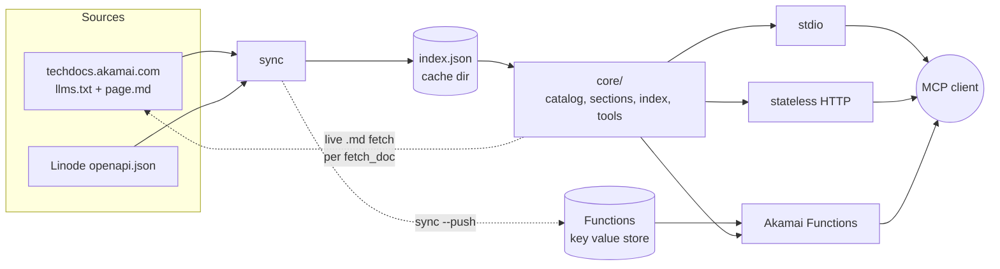

<!-- mcp-name: io.github.labeveryday/akamai-cloud-docs-mcp -->
<div align="center">

# akamai-cloud-docs-mcp

**Token-lean access to Akamai Cloud documentation for AI agents.**

[](LICENSE)
[](https://www.python.org/downloads/)
[](https://modelcontextprotocol.io)

</div>

## About

An MCP server that lets an agent search Akamai Cloud documentation and read the
one section it needs instead of pushing whole pages into the context window.
Two tools, `search_docs` and `fetch_doc`, over 394 guides and 449 API
operations; a section comes back in about 800 bytes instead of a 28 KB page.
Point a client at the hosted instance (public preview), or install from git
with `uv tool install`, run `sync` once (about 45 seconds), and add it to your
client. No PyPI release yet.

### Status

v0.2.0. Install from git, or use the hosted instance (public preview). No PyPI release yet.

## Getting Started

### Use the hosted instance

Nothing to install. In Claude Code:

```bash
claude mcp add --transport http akamai-cloud-docs https://ea3aad34-8539-405f-be73-55201fdec736.fwf.app/mcp
```

Try it from a shell first. One POST, one tool call:

```bash
curl -sS -X POST https://ea3aad34-8539-405f-be73-55201fdec736.fwf.app/mcp \
  -H "Content-Type: application/json" \
  -d '{"jsonrpc":"2.0","id":1,"method":"tools/call",
       "params":{"name":"search_docs","arguments":{"query":"resize database cluster","k":3}}}'
```

The first 200 characters of the answer, captured on 2026-08-28:

```
{"jsonrpc": "2.0", "id": 1, "result": {"content": [{"type": "text", "text": "[{\"id\":\"aiven-manage-database\",\"title\":\"Create and manage database clusters\",\"snippet\":\"This guide walks you thr...
```

It is a public preview on Akamai Functions with no auth, no SLA, and limits
subject to change; the index is refreshed weekly, and a guide section takes
about 1 to 2 seconds because the function fetches it live from techdocs.
Other clients are under [Add it to an MCP client](#add-it-to-an-mcp-client).

### Install locally

Prefer a local install for offline use, for your own index refresh schedule,
or to have no dependency on the preview. You need
[uv](https://github.com/astral-sh/uv) and Python 3.11 or newer.

```bash
uv tool install git+https://github.com/labeveryday/akamai-cloud-docs-mcp
```

Until the repository is published under that name, replace the URL with your
clone's URL. The install puts `akamai-cloud-docs-mcp` on your `PATH`, in
`~/.local/bin` unless `uv tool dir --bin` says otherwise, and every command
below uses that bare name. For a client that runs a full command,
`uvx --from git+https://github.com/labeveryday/akamai-cloud-docs-mcp akamai-cloud-docs-mcp`
works with no install.

### Build the index

```bash
akamai-cloud-docs-mcp sync
```

About 45 seconds, once. That fetches the guide index, every guide page, and
the OpenAPI spec, then writes one `index.json` of about 3.7 MB (3,891,400
bytes on 2026-08-28) to `$XDG_CACHE_HOME/akamai-cloud-docs-mcp/` (or
`~/.cache/akamai-cloud-docs-mcp/`). No documentation text ships in the
package; the index is built from live sources on the machine that runs the
server. Pass `--guides-only` to skip the API catalog. Set
`AKAMAI_DOCS_MCP_CACHE_DIR` to put the file somewhere else.

If you skip this step, the server builds the index in the background on its
first start and answers every tool call with "still building" until it is
done.

Check what is on disk:

```bash
akamai-cloud-docs-mcp status
# path:        /home/you/.cache/akamai-cloud-docs-mcp/index.json
# size:        3.7 MB
# built_at:    2026-08-28T12:08:59Z
# age:         0.3 days
# guides:      394
# api:         449
# api_version: 4.215.0
```

Exit 0 when fresh, 1 when older than 7 days (the line then ends in `STALE`), 2
when missing. `--json` prints one object with the same fields, with the size in
bytes. The `size` line counts 1024-byte units.

On Windows, `uv tool install` puts `akamai-cloud-docs-mcp.exe` on `PATH` the
same way, and `python -m akamai_cloud_docs_mcp` works anywhere the package is
installed.

### Run it

```bash
akamai-cloud-docs-mcp              # stdio
akamai-cloud-docs-mcp --http       # stateless HTTP on 127.0.0.1:8000
```

stdio builds a missing index on a background thread from the moment the process
starts, and tool calls answer "still building" until it is written. When the
cached index is older than 7 days, stdio rebuilds it in the background at
startup; the old index keeps answering until the new file lands. Pass
`--no-auto-sync` to turn both off.

HTTP does not build. A missing index is a startup failure, so an operator never
discovers a 45 second build on a client's first request. Pass `--auto-sync` to
change that. A running HTTP server picks up a rebuilt index by file modification
time on its next request, so `sync` on a timer needs no restart.

Health check:

```bash
curl -s localhost:8000/healthz
# {"name":"akamai-cloud-docs","version":"0.2.0","documents":843,"index_built_at":"2026-08-28T12:08:59Z","index_age_days":0.3,"endpoint":"/mcp"}
```

`GET` and `DELETE` on `/mcp` answer 405 with `Allow: POST`; the server is
stateless, so there is no stream to open and no session to end.

`--log-level debug` shows every request. The default is `info` with `--http`
(uvicorn access lines) and `warning` over stdio. `--allowed-host` and
`--allowed-origin` are described under [Security](#security).

### Add it to an MCP client

Claude Code:

```bash
claude mcp add akamai-cloud-docs -- akamai-cloud-docs-mcp
```

Most clients read a JSON config with an `mcpServers` object. This stdio block
works for Claude Code (`.mcp.json`), Cursor (`~/.cursor/mcp.json`), Claude
Desktop (`claude_desktop_config.json`), Gemini CLI (`~/.gemini/settings.json`),
and Windsurf (`~/.codeium/windsurf/mcp_config.json`):

```json
{
  "mcpServers": {
    "akamai-cloud-docs": {
      "command": "akamai-cloud-docs-mcp"
    }
  }
}
```

Claude Desktop does not search `PATH`, so give it the absolute path, typically
`~/.local/bin/akamai-cloud-docs-mcp` (`uv tool dir --bin` prints the
directory). For a checkout, `"command"` can be the absolute path to
`.venv/bin/akamai-cloud-docs-mcp`. To skip the install step, use
`"command": "uvx"` with
`"args": ["--from", "git+https://github.com/labeveryday/akamai-cloud-docs-mcp", "akamai-cloud-docs-mcp"]`.

MCP stdio clients start the server with a minimal environment (HOME, PATH, and
a few others), so `AKAMAI_DOCS_MCP_CACHE_DIR` must be set in the client's `env`
field for the server (an `"env"` object next to `"command"` in the block above,
the `env` table in `codex.toml`, `env=` in `StdioServerParameters`), not
exported in the shell. `XDG_CACHE_HOME` is stripped the same way. `sync` reads
the same variables from the shell, so set them the same way for both, or leave
both unset.

For an HTTP server, the hosted instance or one you run yourself, this is
Claude Code's `.mcp.json` form. The hosted URL is
`https://ea3aad34-8539-405f-be73-55201fdec736.fwf.app/mcp`; a local server is
`http://127.0.0.1:8000/mcp`. On the command line,
`claude mcp add --transport http akamai-cloud-docs <url>` takes either.

```json
{
  "mcpServers": {
    "akamai-cloud-docs": {
      "type": "http",
      "url": "https://ea3aad34-8539-405f-be73-55201fdec736.fwf.app/mcp"
    }
  }
}
```

The key for the address differs per client, and each takes either URL.
Cursor: `"url"`, no `"type"`. Gemini CLI: `"httpUrl"`. Windsurf:
`"serverUrl"`.

Claude Desktop: Settings, Connectors, Add, then Add custom connector, and
paste `https://ea3aad34-8539-405f-be73-55201fdec736.fwf.app/mcp`. A custom
connector needs a public URL, so a server on 127.0.0.1 cannot be used there;
for a local install use the stdio block above.

VS Code reads `.vscode/mcp.json` with a top-level `servers` object. The same
block with `http://127.0.0.1:8000/mcp` reaches a local server:

```json
{
  "servers": {
    "akamai-cloud-docs": { "type": "http", "url": "https://ea3aad34-8539-405f-be73-55201fdec736.fwf.app/mcp" }
  }
}
```

For stdio in VS Code, use `"type": "stdio"` with the same `command` as above.

Codex CLI: `codex mcp add akamai-cloud-docs -- akamai-cloud-docs-mcp` for
stdio,
`codex mcp add akamai-cloud-docs --url https://ea3aad34-8539-405f-be73-55201fdec736.fwf.app/mcp`
for the hosted instance, or the same with `--url http://127.0.0.1:8000/mcp`
for a local HTTP server. Codex's default `startup_timeout_sec` (10) is enough; the server
answers `initialize` in about a second. With no index on disk the first tool
call answers "still building" until the background build finishes, so run
`sync` first. Ready-to-copy files for Codex (TOML) and Gemini CLI are in
[examples/clients/](examples/clients/). They use the `uvx --from git+...` form,
so they work without the install step.

### Check that it works

```bash
claude mcp list
# akamai-cloud-docs: akamai-cloud-docs-mcp  - ✔ Connected
```

With the hosted instance the line names the URL instead of the command.

Then, in a Claude Code session, ask: "How do I resize a managed database
cluster?" and watch the tool calls. `search_docs` runs first and returns
`aiven-manage-database` at the top; `fetch_doc` then reads its table of
contents and the resize section, the same 839-byte section shown under
[fetch_doc](#fetch_doc) below.

### Remove it

```bash
claude mcp remove akamai-cloud-docs
uv tool uninstall akamai-cloud-docs-mcp
rm -rf ~/.cache/akamai-cloud-docs-mcp
```

## Usage

Every example below was captured from the running server on 2026-08-28. Long
ones are cut with `...`.

### search_docs

`search_docs(query, k=5)` searches both catalogs and returns
`{id, title, snippet}`. An id that starts with an HTTP verb and a path is an
API operation; every other id is a guide slug. `k` is clamped to 1-20. No match
returns an empty list, never an error.

```json
[
  {
    "id": "aiven-manage-database",
    "title": "Create and manage database clusters",
    "snippet": "This guide walks you through creating Akamai Managed Databases powered by Aiven through Cloud Manager. 1. Log in to Cloud Manager and from the main menu, select Databases. 2. Click Create Database Cluster. 3. In the Cluster Label field..."
  },
  {
    "id": "configuration-audit-log-events",
    "title": "Events captured in audit logs",
    "snippet": "...Attempt to resize a Linode to a different plan | post-resize-linode-instance | Resize a Linode | ..."
  },
  {
    "id": "manage-nodes-and-node-pools",
    "title": "Manage nodes and node pools",
    "snippet": "...a group of nodes that all run the same applications and configuration. Each LKE cluster has at least one node pool..."
  }
]
```

An API result's snippet starts with its summary sentence, not with the method
and path the id already carries:

```json
{"id": "GET /linode/instances", "title": "List Linodes", "snippet": "Returns a paginated list of Linodes you have permission to view. Linode instances X-Filter page page_size linode-cli linodes list linode-cli linodes ls"}
```

A query that is exactly a document id returns that document first, and id
words such as the `aclp` in `iam-aclp` are searchable.

### fetch_doc

`fetch_doc(id, section="")` reads one document. Omit `section` for a table of
contents, then call again with a section id from it.

A table of contents is JSON: `{id, title, preamble, sections}`. Each top-level
entry has `id`, `title`, and `children` by title, plus either a one-sentence
`summary` or, when the section has no subsections and is under 300 bytes, its
whole body as `content`. Read `content` in place; do not fetch that section
again. Abridged:

```json
{
  "id": "aiven-manage-database",
  "title": "Create and manage database clusters",
  "preamble": "",
  "sections": [
    {"id": "1", "title": "Create and manage database clusters",
     "summary": "This guide walks you through creating Akamai Managed Databases powered by Aiven through Cloud Manager.",
     "children": [{"id": "1.1", "title": "Create a new database cluster"}]},
    {"id": "2", "title": "Suspend a cluster",
     "summary": "If you don't use a database cluster, you can suspend it so that you won't be billed for it.",
     "children": [{"id": "2.1", "title": "Resume a cluster"}]},
    ...
    {"id": "9", "title": "Resize a Managed Database cluster",
     "summary": "You can upscale database clusters to adapt them to your needs."},
    ...
  ]
}
```

A `content` entry, from `fetch_doc(id="linode-instances-commands")`:

```json
{"id": "2", "title": "There's more", "content": "Many other actions are available. Use `linode-cli linodes --help` for a complete list."}
```

A section, a guide under 8 KB, and an API operation card come back as markdown,
not as a JSON string, so nothing is escaped. A section starts with one header
line naming the document, the section, the id, and the page URL. This is
`fetch_doc(id="aiven-manage-database", section="9")`, whole:

```markdown
# Create and manage database clusters > Resize a Managed Database cluster [aiven-manage-database #9] https://techdocs.akamai.com/cloud-computing/docs/aiven-manage-database

# Resize a Managed Database cluster

You can upscale database clusters to adapt them to your needs.

> ❗️
>
> This operation causes downtime for resized single-node clusters.

1. Log in to [Cloud Manager](https://cloud.linode.com/) and from the main menu, select **Databases**.

2. Select a cluster from the list.

3. Go to the **Resize** tab.

4. In the *Choose a plan* or *Set Number of Nodes* sections, implement your changes to resize the cluster.

5. In the *Summary* section, verify the changes. Click **Resize Database Cluster**.

6. Follow the on-screen instructions and click **Resize Cluster** to confirm. The cluster will be upscaled within two hours.
```

That is what the two calls save. Measured on 2026-08-28 against the live page
and an index built the same day:

| Step | Bytes returned |
|---|---|
| Whole `aiven-manage-database` page, as the server cleans it | 28,612 |
| `fetch_doc(id)` table of contents, 12 sections | 2,495 |
| `fetch_doc(id, section="9")` the resize section, as markdown | 839 |
| **Both calls together** | **3,334, an 88% reduction** |

Guide text is fetched live at call time, so an agent never quotes a stale
page. When the live fetch fails, the second line reads
`Live fetch failed (...); this is the indexed copy.` When a section exceeds
40,000 characters, a `Truncated at 40,000 characters` line follows the header.

`id` accepts a guide slug, a `techdocs.akamai.com` guide URL (with or without a
`#fragment` or a trailing `/`), the reference URL an API card emits
(`https://techdocs.akamai.com/linode-api/reference/<operationId>`),
`"POST /databases/postgresql/instances"`, an operationId, or
`"linode-cli databases postgresql-create"`. Slugs are case-insensitive.

### API and CLI answers

An API id returns one operation card, and nothing around it. These five calls
all return the same card:

```
fetch_doc(id="POST /databases/postgresql/instances")
fetch_doc(id="post /databases/postgresql/instances")
fetch_doc(id="post-databases-postgre-sql-instances")
fetch_doc(id="linode-cli databases postgresql-create")
fetch_doc(id="https://techdocs.akamai.com/linode-api/reference/post-databases-postgre-sql-instances")
```

```markdown
## POST /databases/postgresql/instances

Create or restore a PostgreSQL Managed Database

Provision a PostgreSQL Managed Database

CLI: `linode-cli databases postgresql-create`

Body (required):
- label (string, required): Filterable A unique, user-defined string referring to the Managed Database.
- type (string, required): Filterable The Linode Instance type used by the Managed Database for its nodes.
- engine (string, required): The Managed Database engine in engine/version format.
- region (string, required): Filterable The unique identifier for the region where the Managed Database lives.
- optional: allow_list, cluster_size, engine_config, fork, private_network, ssl_connection

OAuth scopes: databases:read_write

Reference: https://techdocs.akamai.com/linode-api/reference/post-databases-postgre-sql-instances
```

Cards average 408 bytes and the largest of the 449 is 1,077. Response schemas
are left out on purpose. They are the biggest thing in an OpenAPI document and
the least useful for answering "how do I call this". When the index is older
than 7 days a card ends with `From an index built N days ago.`; guide results
carry no such note because their text is fetched live.

### Errors teach

A wrong id does not return a stack trace. It returns the three closest real ids:

```json
{
  "error": "No document matches id 'resize-a-database-cluster'.",
  "did_you_mean": [
    {"id": "aiven-database-clusters", "title": "Managed database clusters"},
    {"id": "create-a-cluster", "title": "Create a cluster"},
    {"id": "aiven-manage-database", "title": "Create and manage database clusters"}
  ],
  "hint": "Ids come from search_docs results. Use the id field verbatim."
}
```

A wrong section returns the top-level sections. Abridged:

```json
{
  "error": "Section '99' does not exist in 'aiven-manage-database'.",
  "valid_sections": [
    {"id": "1", "title": "Create and manage database clusters"},
    {"id": "2", "title": "Suspend a cluster"},
    ...
    {"id": "12", "title": "Delete a Managed Database cluster"}
  ],
  "hint": "Pick a section id from valid_sections. Omit section to see subsections too."
}
```

Both come back as `isError` results.

### Calling it over raw HTTP

A tool call is one POST with a JSON content type and a JSON-RPC body. No
protocol headers are needed, and the hosted URL from Getting Started works in
place of the local one:

```bash
curl -sS -X POST http://127.0.0.1:8000/mcp \
  -H "Content-Type: application/json" \
  -d '{"jsonrpc":"2.0","id":1,"method":"tools/call",
       "params":{"name":"search_docs","arguments":{"query":"resize database cluster","k":3}}}'
```

Sending `MCP-Protocol-Version: 2026-07-28` switches the SDK into strict mode,
where the same body without a `params._meta` envelope gets 400 with code
-32602, so omit the header or send the full envelope, never half. The strict
form:

```bash
curl -sS -X POST http://127.0.0.1:8000/mcp \
  -H "Content-Type: application/json" \
  -H "Accept: application/json, text/event-stream" \
  -H "MCP-Protocol-Version: 2026-07-28" \
  -H "Mcp-Method: tools/call" \
  -H "Mcp-Name: search_docs" \
  -d '{"jsonrpc":"2.0","id":1,"method":"tools/call","params":{
        "name":"search_docs",
        "arguments":{"query":"resize database cluster","k":3},
        "_meta":{
          "io.modelcontextprotocol/protocolVersion":"2026-07-28",
          "io.modelcontextprotocol/clientCapabilities":{}
        }}}'
```

Which transport speaks what:

- **stdio and HTTP** (the `mcp` SDK server): the 2025-11-25 handshake era
  (`initialize`, then `tools/list` and `tools/call`) and 2026-07-28
  (`server/discover`, a `params._meta` envelope on every request). The HTTP
  transport is stateless: no session header, no server-to-client stream.
- **Akamai Functions**, which is what the hosted instance runs: the
  2025-11-25 handshake era only. Details in
  [functions/README.md](functions/README.md).

Both tools advertise a title and `readOnlyHint: true`, `idempotentHint: true`,
`destructiveHint: false`, `openWorldHint: false`, so a client that gates
destructive tools behind a prompt runs these without one. Every parameter has a
description and the string parameters carry `maxLength`. The `tools/list`
result is 2,196 bytes on the wire. The SDK also advertises `prompts` and
`resources` capabilities this server never uses; mcp 2.x has no switch for
them.

### From Python

[examples/python/](examples/python/) has one file each for the raw `mcp`
client, Strands Agents, the OpenAI Agents SDK, the OpenAI Chat Completions
API with the tool loop written out (the file that also runs against vLLM),
LangChain through `langchain-mcp-adapters`, and the Claude API MCP connector. Strands and
`langchain-mcp-adapters` pin `mcp<2` while the server needs `mcp>=2`, so those
two run from their own venv; the wire protocol is the same. The Claude API
connector reaches the hosted instance by default and reads
`AKAMAI_DOCS_MCP_URL` to use another. The README there has the commands.

```bash
.venv/bin/python examples/python/mcp_client.py
# server: akamai-cloud-docs 0.2.0, protocol 2025-11-25
# search_docs: [{"id":"aiven-manage-database", ...
```

## Development

```bash
git clone https://github.com/labeveryday/akamai-cloud-docs-mcp
cd akamai-cloud-docs-mcp
uv sync --extra dev                  # installs from uv.lock into .venv
.venv/bin/pytest                     # 828 tests, offline; the suite blocks outbound sockets
.venv/bin/ruff check .
.venv/bin/python scripts/check_wheel.py   # the wheel and the sdist carry code only
```

From a checkout, `.venv/bin/akamai-cloud-docs-mcp` is the command, and its
absolute path is what a client's `"command"` field should hold.

Every test fixture is invented content. No Akamai documentation is copied into
this repository. CI runs lint and tests on Python 3.11, 3.12, and 3.13, each
installed from `uv.lock`, plus the wheel and sdist gate.

If you change ranking (`core/index.py`) or parsing (`core/sections.py`,
`core/catalog.py`), run `scripts/rank_check.py` and `scripts/section_check.py`
against a fresh `sync` and paste the before and after numbers in the pull
request. See [CONTRIBUTING.md](CONTRIBUTING.md).

The eval harness needs `uv sync --extra dev --extra eval`, then
`.venv/bin/python eval/harness.py` (or `--from-raw` to rebuild the report
without API calls). It reads `OPENAI_API_KEY`, `OPENAI_EVAL_MODEL`,
`VLLM_API_ENDPOINT`, `VLLM_API_KEY`, and `VLLM_MODEL` from the environment,
skips a provider whose variables are missing, and writes nothing from the
environment into the results.

### How it is built



Two catalogs go into the index: the guides, 394 pages from
`techdocs.akamai.com` on 2026-08-28, fetched as raw markdown, and the API
reference, 449 operations built from the Linode OpenAPI spec, 409 of them
carrying the matching `linode-cli` command. The index holds text for ranking
and snippets plus the prebuilt search index; guide content is fetched live at
call time, and the indexed copy is the fallback.

Each guide is stored as cleaned markdown: frontmatter, HTML comments, and the
trailing `Sub pages` and `Sibling pages` link lists are removed, and readme.io
`[block:...]` JSON is rewritten as a table, a caption, or the HTML it wrapped.
Rebuild after upgrading; an index built by an earlier version still loads but
keeps the old text.

The sync fails rather than writing a thin index if fewer than 300 guide pages or
400 operations parse. A source format change should be loud.

`scripts/check_wheel.py` builds the wheel and the sdist and fails if either
contains an index, a fixture, a test path, or any non-source file. It runs in
CI on every push to `main` and every pull request, and in the Dockerfile's
builder stage.

## Security

Report a vulnerability through GitHub private vulnerability reporting. The
scope, the response times, and the full list of enforced rules are in
[SECURITY.md](SECURITY.md); the rules are pinned by `tests/test_security.py`.

- The server never fetches a URL a model composed. A tool argument names a
  document; the server builds the URL itself and checks it, and every
  redirect, against a scheme, host, and path allowlist.
- Outbound requests are https only, time out after 30 seconds, and stop at
  2 MB per page.
- HTTP mode binds 127.0.0.1. Put a reverse proxy in front, terminate TLS
  there, and pass `--allowed-host` (a bare name and `name:*`) so the Host and
  Origin checks stay on for a non-loopback bind.
- No traceback and no filesystem path reaches a tool result.
- The wheel and the sdist carry code only, and the dependency tree is locked
  in `uv.lock`; CI installs from the lock and GitHub Actions are pinned by
  commit SHA.

The hosted instance has no auth, the same as Microsoft Learn's MCP
endpoint. Akamai Functions has no platform rate limit, so the
exposure is per-request CPU, the key value store read quota (1,000 reads per
second per app; a call reads the meta key plus 5 chunks today), and 128 MiB per
execution. A `fetch_doc` for a guide reads techdocs live; on a read failure of
any kind, a 429 included, it falls back to the indexed copy.

## Deployment

### A Linode, or any host you control

Run `sync` once, then on a timer, and serve HTTP behind a reverse proxy that
terminates TLS. The three units in [examples/deploy/](examples/deploy/) do that:
`akamai-docs-sync.service` builds the index, `akamai-docs-sync.timer` reruns it
weekly, and `akamai-cloud-docs-mcp.service` serves HTTP on 127.0.0.1:8000 with
the index in `/var/lib/akamai-cloud-docs-mcp`. The units expect the checkout at
`/opt/akamai-cloud-docs-mcp` with its venv. As root:

```bash
git clone https://github.com/labeveryday/akamai-cloud-docs-mcp /opt/akamai-cloud-docs-mcp
cd /opt/akamai-cloud-docs-mcp && uv sync
cp examples/deploy/akamai-cloud-docs-mcp.service examples/deploy/akamai-docs-sync.service examples/deploy/akamai-docs-sync.timer /etc/systemd/system/
systemctl daemon-reload
useradd --system --home-dir /nonexistent --shell /usr/sbin/nologin mcp
systemctl enable --now akamai-docs-sync.timer
systemctl start akamai-docs-sync.service
systemctl enable --now akamai-cloud-docs-mcp.service
```

The `systemctl start` builds the index once before the first server start and
takes about 45 seconds. The running server picks up a new index by file
modification time without a restart; the restart after each sync only matters
for a package upgrade. The server unit does not pull the sync unit in, so a
server restart never triggers a rebuild.

Pass the Host the proxy forwards (Caddy keeps the original by default; nginx
needs `proxy_set_header Host $host`):

```ini
ExecStart=/opt/akamai-cloud-docs-mcp/.venv/bin/akamai-cloud-docs-mcp --http --port 8000 --allowed-host docs.example.com --allowed-host docs.example.com:*
```

Probe `http://127.0.0.1:8000/healthz` for readiness. `akamai-cloud-docs-mcp status`
exits 1 when the index is older than 7 days, so it can guard the sync timer.

A weekly rebuild is enough. Guide text is fetched live on every `fetch_doc`, so
the index only affects search ranking and the API cards.

### Docker

The Dockerfile is in [examples/deploy/](examples/deploy/). It builds the wheel,
runs the release gate, installs the dependencies pinned and hashed from
`uv.lock`, then the wheel, as a non-root user. The image is not built or
published anywhere yet; a tagged release will push it to
`ghcr.io/labeveryday/akamai-cloud-docs-mcp`.

```bash
docker build -t akamai-cloud-docs-mcp -f examples/deploy/Dockerfile .
docker run -p 127.0.0.1:8000:8000 -v akamai-docs:/cache akamai-cloud-docs-mcp --http --host 0.0.0.0 --auto-sync
```

The server binds 127.0.0.1 by default, so inside a container pass
`--host 0.0.0.0`; `-p 127.0.0.1:8000:8000` keeps the published port on the
host's loopback. To reach it from another machine, put a TLS-terminating proxy
in front and add `--allowed-host <name> --allowed-host <name>:*`, as in the
systemd example above. For an MCP client that launches the container itself:

```bash
docker run -i --rm --no-healthcheck -v akamai-docs:/cache akamai-cloud-docs-mcp
```

`--no-healthcheck` because the image's health check probes `/healthz`, which a
stdio run never serves.

### Akamai Functions

The same server runs as a WebAssembly component on Spin, with the index in the
Functions key value store. Akamai Functions is in public preview and its limits
are subject to change. The reference deployment is the hosted instance,
`https://ea3aad34-8539-405f-be73-55201fdec736.fwf.app`, in the `devrel-demos`
account, deployed 2026-08-28. To run your own, build and deploy from
`functions/`, then push the index from the repository root, in the project
venv:

```bash
(cd functions && spin build)
read -rs FUNCTIONS_SYNC_TOKEN < <(openssl rand -hex 32); export FUNCTIONS_SYNC_TOKEN
(cd functions && spin aka deploy --build --no-confirm --account-name <team> --variable sync_token="$FUNCTIONS_SYNC_TOKEN")

# from the repository root, in the project venv
.venv/bin/akamai-cloud-docs-mcp sync --push https://<uuid>.fwf.app
```

The full walkthrough, from prerequisites to teardown, with the platform
constraints and the measured per-call latency, is in
[functions/README.md](functions/README.md).

## Eval

`eval/harness.py` measures what the server does for a model's answers and its
token bill: twelve questions with gold facts read out of the live
documentation, two models, run on 2026-08-28 against the 0.2.0 wire format.

| | no tools | with tools |
|---|---|---|
| gpt-5-mini, fact accuracy | 76% | **100%** |
| Qwen2.5-7B-Instruct, fact accuracy | 36% | **88%** |
| Qwen2.5-7B-Instruct, `linode-cli` questions | 0% | **67%** |

With tools, gpt-5-mini spent 7,232 prompt tokens and 3.2 tool calls per
question, which is the price of the 100%. The `linode-cli` answers are exact
command strings such as `linode-cli databases postgresql-create`, the case
where guessing does worst and a lookup does best. Three payload cuts (a text
table of contents, 160-character snippets, and one more sentence in the search
description) were measured under the same harness and not shipped: each saved
prompt tokens on gpt-5-mini, and each cost the 7B model at least one fact on
twelve questions, which is not enough evidence to call the cut safe.

Full tables, per-question records, the three decisions, and the method are in
[eval/RESULTS.md](eval/RESULTS.md) and `eval/raw_results.jsonl`.

## Roadmap

- Publish to PyPI and the MCP Registry so `uvx akamai-cloud-docs-mcp` works.
  The workflow is written; the PyPI trusted publisher is the one-time setup left.

## License

Apache-2.0. See [LICENSE](LICENSE).

## Contact

Du'An Lightfoot, Akamai DevRel. `dlightfo@akamai.com`

## Acknowledgments

- The [strands-agents MCP server](https://github.com/strands-agents/harness-sdk/tree/main/strands-mcp)
  for the search plus table-of-contents tool shape this design follows.
- The [Akamai Functions sports MCP server](https://github.com/akamai-developers/akamai-functions-sports-mcp-server)
  for the stateless handler and deployment pattern used later in `functions/`.
